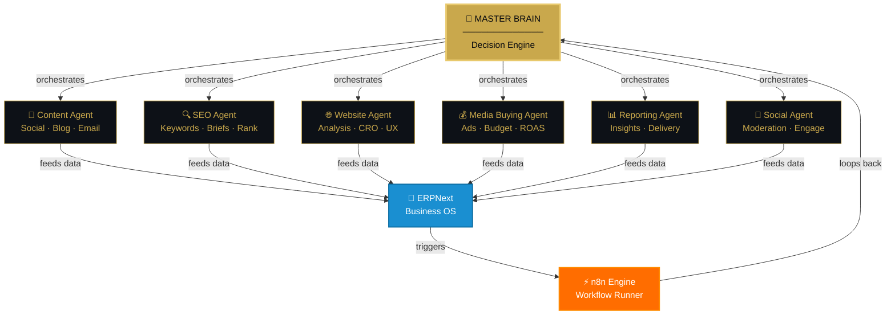
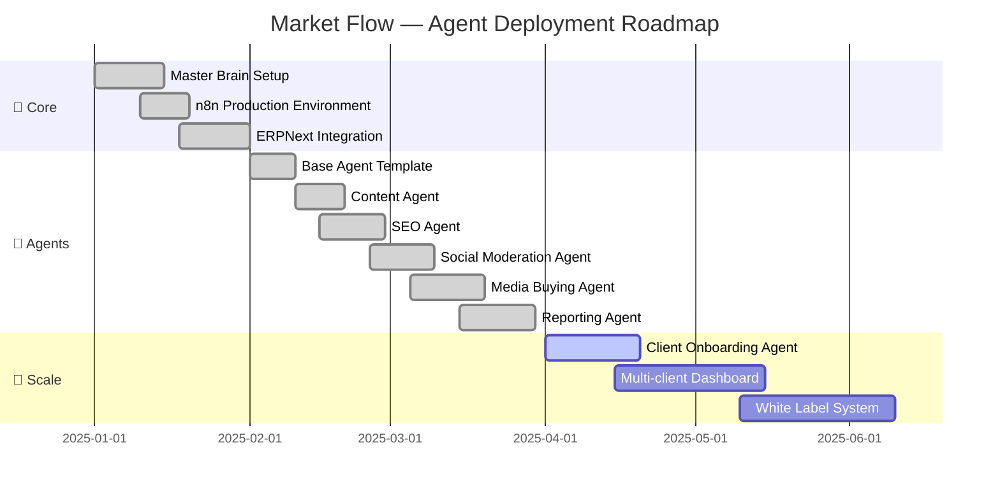

<div align="center">

<!-- ANIMATED HEADER -->


<!-- TYPING ANIMATION -->
<a href="https://git.io/typing-svg">
  
</a>

<br/>

<!-- BADGES ROW 1 -->


<br/><br/>

<!-- BADGES ROW 2 -->


</div>

---

<div align="center">

## ⚡ THE SYSTEM IN ONE FRAME

```
╔══════════════════════════════════════════════════════════════════════╗
║                                                                      ║
║    ██╗    ██╗ █████╗ ██████╗ ██╗  ██╗███████╗████████╗              ║
║    ███╗  ███║██╔══██╗██╔══██╗██║ ██╔╝██╔════╝╚══██╔══╝              ║
║    ████╗████║███████║██████╔╝█████╔╝ █████╗     ██║                 ║
║    ██╔████╔██║██╔══██║██╔══██╗██╔═██╗ ██╔══╝     ██║                 ║
║    ██║╚██╔╝██║██║  ██║██║  ██║██║  ██╗███████╗   ██║                 ║
║    ╚═╝  ╚═╝ ╚═╝  ╚═╝╚═╝  ╚═╝╚═╝  ╚═╝╚══════╝   ╚═╝                 ║
║                                                                      ║
║         ███████╗██╗      ██████╗ ██╗    ██╗                         ║
║         ██╔════╝██║     ██╔═══██╗██║    ██║                         ║
║         █████╗  ██║     ██║   ██║██║ █╗ ██║                         ║
║         ██╔══╝  ██║     ██║   ██║██║███╗██║                         ║
║         ██║     ███████╗╚██████╔╝╚███╔███╔╝                         ║
║         ╚═╝     ╚══════╝ ╚═════╝  ╚══╝╚══╝                         ║
║                                                                      ║
║  ◆  AI Marketing Department · Built on n8n · Powered by ERPNext  ◆  ║
╚══════════════════════════════════════════════════════════════════════╝
```

</div>

---

<div align="center">

## 🧠 MASTER BRAIN ARCHITECTURE



</div>

---

<div align="center">

## ⚡ AGENT STATUS · LIVE

| Agent | Department | Status | Uptime |
|:------|:-----------|:------:|:------:|
| 🧠 **Master Brain** | Core Orchestrator |  | `99.9%` |
| 📝 **Content Agent** | Content & Social |  | `99.7%` |
| 🔍 **SEO Agent** | Research & Briefs |  | `99.8%` |
| 🌐 **Website Agent** | Analysis & CRO |  | `98.9%` |
| 📱 **Social Agent** | Moderation & Engage |  | `99.5%` |
| 💰 **Media Buying Agent** | Ads & Optimization |  | `99.6%` |
| 📊 **Reporting Agent** | Insights & Delivery |  | `99.9%` |
| 👥 **Onboarding Agent** | Client Delivery |  | `100%` |

</div>

---

<div align="center">

## 🔄 THE DECISION LOOP

```
  ┌──────────────────────────────────────────────────────────┐
  │                                                          │
  │   TRIGGER  ──►  THINK  ──►  DECIDE  ──►  EXECUTE        │
  │      ▲                                      │           │
  │      │                                      ▼           │
  │   LEARN   ◄──  ANALYZE  ◄──  REPORT  ◄──  MONITOR       │
  │                                                          │
  └──────────────────────────────────────────────────────────┘
          ↕                              ↕
       n8n Workflow              ERPNext Data Layer
```

</div>

---

<div align="center">

## 🛠️ TECH STACK


<br/><br/>

| Layer | Technology |
|:------|:-----------|
| 🔄 **Automation** | `n8n` · Self-hosted · Production Grade |
| 🧠 **AI Models** | `OpenAI GPT-4o` · `Claude 3.5` · `Gemini` |
| 🏢 **Business OS** | `ERPNext` · `Frappe Framework` |
| 📦 **Infrastructure** | `Docker` · `Ubuntu Server` · `Nginx` |
| 🔐 **Security** | `API Keys Vault` · `Encrypted Credentials` |
| 📊 **Analytics** | `Custom Dashboards` · `Real-time Metrics` |
| 🌐 **Integrations** | `Meta` · `Google` · `LinkedIn` · `WhatsApp API` |

</div>

---

<div align="center">

## 📊 IMPACT METRICS

```
  ╔═══════════════════════════════════════════════════════════╗
  ║                                                           ║
  ║   TASKS AUTOMATED    CONTENT PIECES    REPORTS SENT       ║
  ║   ━━━━━━━━━━━━━━━    ━━━━━━━━━━━━━━    ━━━━━━━━━━━        ║
  ║       14,823+            1,247+           892+            ║
  ║                                                           ║
  ║   ROI MULTIPLIER     HOURS SAVED      UPTIME              ║
  ║   ━━━━━━━━━━━━━━━    ━━━━━━━━━━━━━    ━━━━━━━━            ║
  ║        3.2 ×           8,400 hrs       99.9%             ║
  ║                                                           ║
  ╚═══════════════════════════════════════════════════════════╝
```

</div>

---

<div align="center">

## 🔌 INTEGRATIONS ECOSYSTEM


</div>

---

<div align="center">

## 🗺️ ROADMAP · الخارطة



</div>

---

<div align="center">

## 🏗️ WORKFLOW ANATOMY

```
  CLIENT TRIGGERS EVENT
        │
        ▼
  ┌─────────────────┐
  │   n8n LISTENER  │  ◄── Webhook / Schedule / API
  └────────┬────────┘
           │
           ▼
  ┌─────────────────┐
  │  MASTER BRAIN   │  ◄── Classifies Intent
  │  Decision Loop  │  ◄── Routes to Agent
  └────────┬────────┘
           │
     ┌─────┴──────┐
     │            │
     ▼            ▼
  AGENT A      AGENT B     ◄── Parallel Execution
     │            │
     └─────┬──────┘
           │
           ▼
  ┌─────────────────┐
  │    ERPNext      │  ◄── Logs + CRM + Data
  │   Data Store    │
  └────────┬────────┘
           │
           ▼
  ┌─────────────────┐
  │  REPORT ENGINE  │  ◄── Insight Generation
  │  Auto Delivery  │  ◄── Client Dashboard
  └─────────────────┘
```

</div>

---

<div align="center">

## 🌍 BUILT FOR THE ARAB MARKET

```
  ╔════════════════════════════════════════════════╗
  ║                                                ║
  ║    🇸🇦  Saudi Arabia   🇦🇪  UAE   🇪🇬  Egypt     ║
  ║                                                ║
  ║    عربي  ✓   English  ✓   RTL/LTR  ✓          ║
  ║                                                ║
  ║    Market Flow يتكلم لغتك ويفهم سوقك           ║
  ║                                                ║
  ╚════════════════════════════════════════════════╝
```


</div>

---

<div align="center">

## 🚀 QUICK START

```bash
# Clone the system
git clone https://github.com/marketflow/ai-marketing-system

# Setup environment
cp .env.example .env
# Add your API keys → OpenAI · ERPNext · n8n

# Launch with Docker
docker-compose up -d

# Activate Master Brain
curl -X POST http://localhost:5678/webhook/master-brain \
  -H "Content-Type: application/json" \
  -d '{"action": "initialize", "client": "YOUR_CLIENT_ID"}'

# Watch agents come alive 🤖
```

</div>

---

<div align="center">

## 📡 AGENT COMMUNICATION PROTOCOL

```json
{
  "from": "master_brain",
  "to": "content_agent",
  "priority": "HIGH",
  "task": {
    "type": "generate_content",
    "platform": "instagram",
    "brand_voice": "professional_warm",
    "topic": "product_launch",
    "deliverables": ["caption", "hashtags", "story_script"]
  },
  "deadline": "2025-02-24T18:00:00Z",
  "callback": "reporting_agent",
  "erp_log": true
}
```

</div>

---

<div align="center">

## 📈 ACTIVITY


</div>

---

<div align="center">

<!-- WAVE FOOTER -->


<br/>

**Built with** ⚡ **n8n** · 🧠 **AI** · 🏢 **ERPNext** · ❤️ **for the Arab World**

<br/>


</div>
